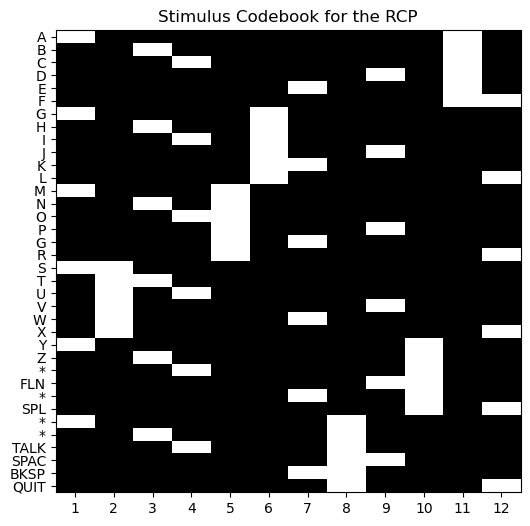
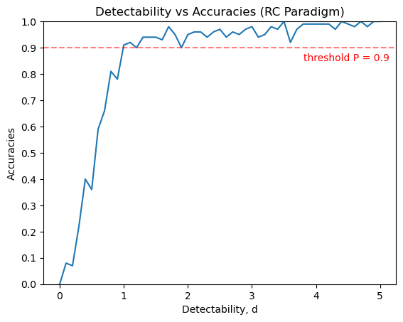
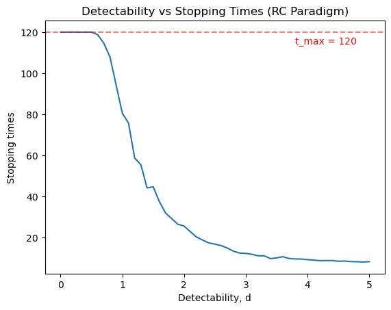
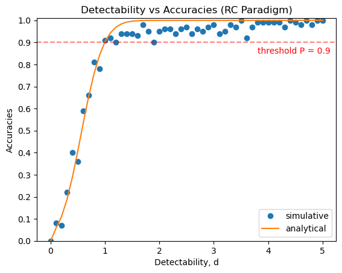
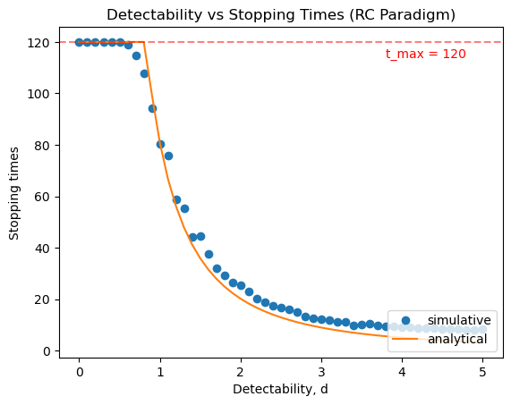

# **Independent Study Weekly Meeting 4**

#### Debug Simulation Script and Add Analytical Estimation

Zion Sheng
Department of ECE
Duke University

---
## Table of Content

1. Part 1: Progess Made This Week
2. Part 2: Debug the Simulation Script
3. Part 3: Results
4. Part 4: Deeper Thoughts

---
## Part 1: Progess Made This Week
<style scoped>
img[alt~="center"] {
  display: block;
  margin: 0 auto;
}
</style>

- Successfully debug the simalation script
- Add analytical estimations of accuracy and EST
- Try to run the script in DCC

---
## Part 2: Debug the Simulation Script
<style scoped>
img[alt~="center"] {
  display: block;
  margin: 0 auto;
}

section {
  font-size: 25px
}
</style>

### Introduce Codebook $\mathcal{F}$
- Previously: Randomly select a row or a column to flash each time.
- Problem: each row/column is not flashed evenly
- Correction: Introduce the codebook, flashing the sequence $(R+C)$ for $s$ (sequence limit) times. Rows and columns are randomly ordered in a sequence.


---
## Part 2: Debug the Simulation Script
<style scoped>
img[alt~="center"] {
  display: block;
  margin: 0 auto;
}

section {
  font-size: 25px
}
</style>
### Try A Test Input
Use the classic $6 \times 6$ RCP board, and set 'B' as the target.
```
board = np.array([['A', 'G', 'M', 'S', 'Y',   '*'   ],
                  ['B', 'H', 'N', 'T', 'Z',   '*'   ],
                  ['C', 'I', 'O', 'U', '*',   'TALK'],
                  ['D', 'J', 'P', 'V', 'FLN', 'SPAC'],
                  ['E', 'K', 'G', 'W', '*',   'BKSP'],
                  ['F', 'L', 'R', 'X', 'SPL', 'QUIT']])
```

Intentionally set a squence to be `[col1 for i in range(6+6)]`. We should expect to see the scores of all characters in column #1 are the same, which are higher than the scores of the rest characters, which are also the same. But it doesn't! The scores in column #1 differ from each other! There are must be a problem.

**DEBUG:** We should compute the classifier score $y$ for each flash (trial) **before** updating scores of each character.

---
## Part 3: Results
<style scoped>
img[alt~="center"] {
  display: block;
  margin: 0 auto;
}

section {
  font-size: 25px
}
</style>

### Monte Carto Simulation

- $6 \times 6$ RCP

- 50 detectability indices $d$ spanning from 0 (included) to 5 (included) evenly.

- For each indices, run 100 simulation trials and calculate the average accuracy and EST.

- In each simulation trial, run a randomly orderred sequence $(R+C)$ for $s=10$ times at most, so the maximum trial $t_{max} = 120$.

---
## Part 3: Results
<style scoped>
img[alt~="center"] {
  display: block;
  margin: 0 auto;
}

section {
  font-size: 25px
}
</style>

### Monte Carto Simulation
| | |
|-|-|

---
## Part 3: Results
<style scoped>
img[alt~="center"] {
  display: block;
  margin: 0 auto;
}

section {
  font-size: 25px
}
</style>

### Simulative and Analytical Results
| | |
|-|-|

---
## Part 4: Deeper Thoughts
<style scoped>
img[alt~="center"] {
  display: block;
  margin: 0 auto;
}

section {
  font-size: 25px
}
</style>

- Why the analytical results work?
- Running on DCC.