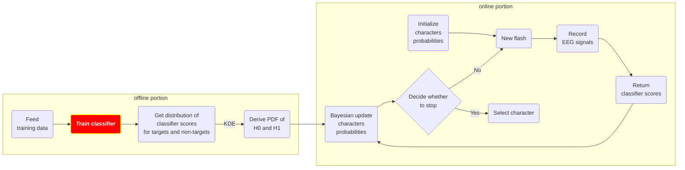

# README for Task 7

> **Attention** ‼️
>
> Task 7 is fundamentally updated (commit ID: `57a9b28`). Long story short: in the self-directed final project of ECE684 ([link](https://gitlab.com/m11298/duke_ece684) to the GitLab repo), we also did some experiment with EEGNet. We started from using the old code here, and soon realized a bug that we should tackle - the problem of unbalanced data (targets only takes up 12%). After some debugging and improvement, the upgraded code there works very well, so we decided to replace the old code in task 7 by the new code there.

## Abstract

<b>Figure 1</b>: The workflow of the P300 speller development (highlighting the part where we will improve) 

In this task, we are going to create a CNN-based classifier to classify the EEG signals (`1`: with the appearance of event-related potential; `0`: w/o ERP). Previously, the classification algorithm we used here was `SWLDA`, and it can achieve state-of-the-art performance (accuracy and stop time) in practice. Plus, it is a lightweight model and it's fast to train. However, the drawback is that it has to be user-specific and it requires a training session before use, which tends to be an extra burden for the users. Now, we want to answer this question - "Is there any algorithm that can realize both **zero-training** and **generalizability** for this classification problem?". In other words, we want a better algorithm to be able to work nicely on most users with just a one-shot pre-training. Recently, several studies have shown that deep learning methods (especially CNN) are one of the promising candidates for this problem. We choose Lee et al.'s work (2020) [1] to be the prototype for task 7, where they implement a CNN-based classifier called `EEGNet`, which was first introduced by Lawhern et al. (2018) [2]. In this work, the `EEGNet` model is specifically adapted to the P300 speller, so this paper is ideal for us as a reference to build our classifier.

## Implementation Overview

## Q&A

Q1: Can we confirm that the EEGNet can be generalized on different users? If so, theoretically why CNN can achieve this whereas traditional methods like SWLDA can't?

> Comments: It takes longer time and more computation power to train a EEGNet, so the model should be able to work across different users. Otherwise, it is not cost-effective. EEGNet训练成本太高啦，如果还是user-specific，每次都要等很久才能训练好这个classifier更不划算。但如果有很好的泛化能力，那么均摊下来的训练成本就可以接受。 

A: 根据论文，作者确实是假设EEGNet具有泛化能力，即在未见的数据点上也能保持较好的预测性能。而实验结果也支持这一点。零训练和有训练的EEGNet均能达到和SWLDA相近的测试准确度。这里摘录一些原文：“With this goal, our study begins with an offline experiment through which we show that a CNN can achieve reasonable performance only by using other subjects' data.”， 

Q2: Compared to the benchmark method (we choose SWLDA here), is the train/test accuracy derived by EEGNet higher than the benchmark? (the gap and statistical significance)

Q3: We found a serious bug in the implementation. The training and validation (testing) process looks good, but strange things happen when we feed other data into the network because it either predicted the result of all 0 or all 1. We need further investigations. Here are some things to check: 1) the distribution of trained weights; 2) why validation process looks good but predicting on the same data set is problematic? 3) why the prediction output of the early models (from earlier epochs) and later models remains the same (`ep-1`, `6`, `10`) where they should be the same according to the accuracy/loss curves.

## Reference

[1] Lee, Jongmin, et al. "CNN with large data achieves true zero-training in online P300 brain-computer interface." *IEEE Access* 8 (2020): 74385-74400.

[2] Lawhern, Vernon J., et al. "EEGNet: a compact convolutional neural network for EEG-based brain–computer interfaces." *Journal of neural engineering* 15.5 (2018): 056013.

