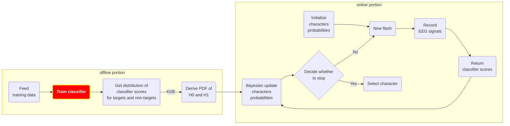

# README for Task 7

## Abstract

<b>Figure 1</b>: The workflow of the P300 speller development (highlighting the part where we will improve) 

In this task, we are going to create a CNN-based classifier to classify the EEG signals (`1`: with the appearance of event-related potential; `0`: w/o ERP). Previously, the classification algorithm we used here was `SWLDA`, and it can achieve state-of-the-art performance (accuracy and stop time) in practice. Plus, it is a lightweight model and it's fast to train. However, the drawback is that it has to be user-specific and it requires a training session before use, which tends to be an extra burden for the users. Now, we want to answer this question - "Is there any algorithm that can realize both **zero-training** and **generalizability** for this classification problem?". In other words, we want a better algorithm to be able to work nicely on most users with just a one-shot pre-training. Recently, several studies have shown that deep learning methods (especially CNN) are one of the promising candidates for this problem. We choose Lee et al.'s work (2020) [1] to be the prototype for task 7, where they implement a CNN-based classifier called `EEGNet`, which was first introduced by Lawhern et al. (2018) [2]. In this work, the `EEGNet` model is specifically adapted to the P300 speller, so this paper is ideal for us as a reference to build our classifier.

## Implementation Overview

## Q&A

## Reference

[1] Lee, Jongmin, et al. "CNN with large data achieves true zero-training in online P300 brain-computer interface." *IEEE Access* 8 (2020): 74385-74400.

[2] Lawhern, Vernon J., et al. "EEGNet: a compact convolutional neural network for EEG-based brain–computer interfaces." *Journal of neural engineering* 15.5 (2018): 056013.

