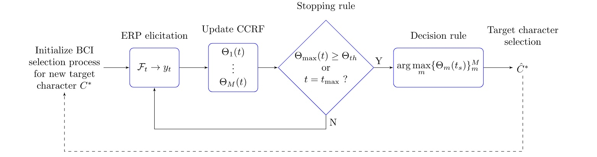

# **Independent Study Weekly Meeting 3**

#### Reproduce Monte Carlo Simulation for the Bayesian DS Algorithm with RC Paradigm

Zion Sheng
Department of ECE
Duke University

---
## Table of Content

1. Part 1: Progess This Week
2. Part 2: Generalized Framework of ERP-based Spellers (Overview)
3. Part 3: Design of the Monte Carlo Simulation
4. Part 4: Results
5. Part 5: Get Ready for the Next Step
6. References

---
## Part 1: Progess This Week

---
## Part 2: Generalized Framework of ERP-based Spellers (Overview)

---
## Part 3: Design of the Monte Carlo Simulation

---
## Part 4: Results

---
## Part 5: Get Ready for the Next Step
