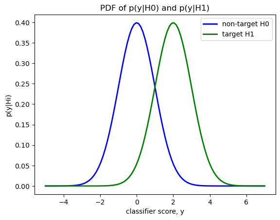
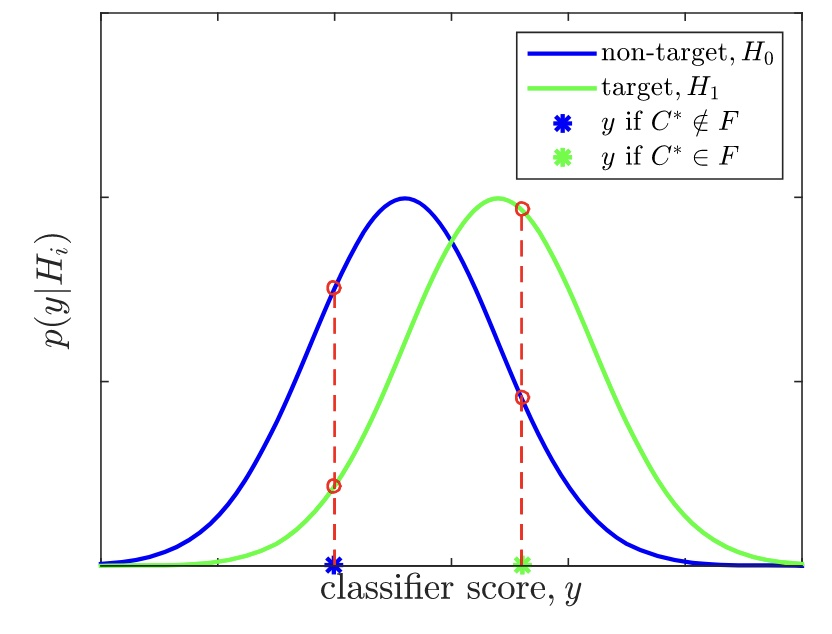
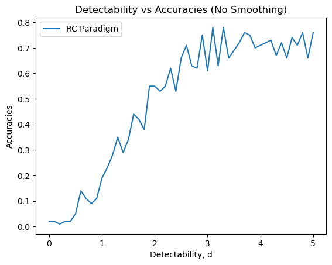
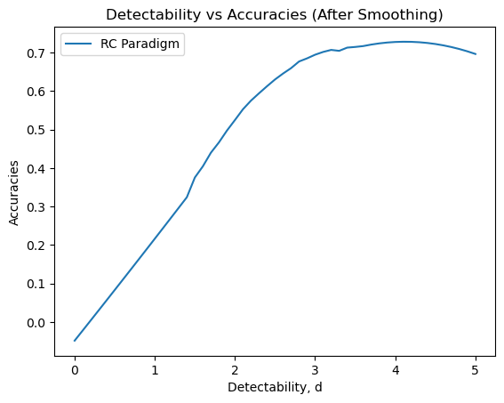
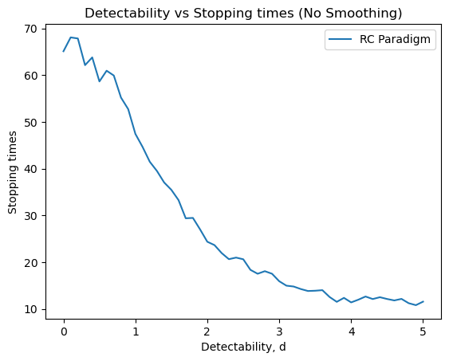
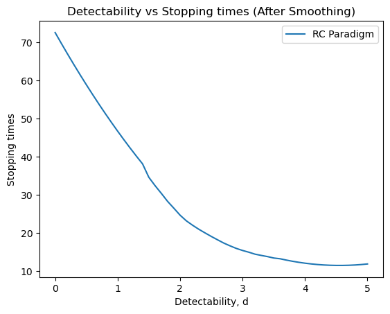

# **Independent Study Weekly Meeting 3**

#### Reproduce Monte Carlo Simulation for the Bayesian DS Algorithm with RC Paradigm

Zion Sheng
Department of ECE
Duke University

---
## Table of Content

1. Part 1: Progess Made This Week
2. Part 2: Generalized Framework of ERP-based Spellers (Overview)
3. Part 3: Design of the Monte Carlo Simulation
4. Part 4: Bayesian DS Algorithm
5. Part 5: Results
6. Part 6: Deeper Thoughts

---
## Part 1: Progess Made This Week
<style scoped>
img[alt~="center"] {
  display: block;
  margin: 0 auto;
}
</style>

- Reproduce the performance simution in Python
- Read section 1, 2, 3.1, 3.3 of the paper (Mainsah et al., 2016)
- Meet with Janet

---
## Part 2: A Generalized Framework of ERP-based Spellers
<style scoped>
img[alt~="center"] {
  display: block;
  margin: 0 auto;
}

section {
  font-size: 25px
}
</style>

Figure 1: The framework of the Generalized ERP-based Speller (Mainsah et al., 2016)

Based on this framework, the presentation paradigm, the way to elicit ERP, classifier, CCRF, stopping rules, and decision rules are all customizable for any specific ERP-based speller. In this project, we use row-column (RC) paradigm, P300 ERP, and Bayesian dynamic stopping algorithm for the performance simulation.

---
## Part 3: Design of the Monte Carlo Simulation
<style scoped>
img[alt~="center"] {
  display: block;
  margin: 0 auto;
}

section {
  font-size: 25px
}
</style>


We generate two probability density functions for classifier core $y$ under condition that the target is flashed or not, respectively. We assume that both PDFs, $p(y|H_0), p(y|H_1)$, are in Guassian distribution, but differ in their means and standard deviations.

Theoratical analysis (Mainsah et al., 2016) shows that a user's performance level can be parameterized with a single value via a measure called the **detectability index** $d$, which is defined as
$$
d = \frac{\mu_1 - \mu_0}{\sqrt{0.5(\sigma_1^1 + \sigma_0^2)}}
$$
The detectability index is a metric that quantifies the discriminability between two normal probability distributions.

---
## Part 3: Design of the Monte Carlo Simulation
<style scoped>
img[alt~="center"] {
  display: block;
  margin: 0 auto;
}

section {
  font-size: 25px
}
</style>

For the simplicity, we set the standard deviation of $p(y|H_0), p(y|H_1)$ to be the same, and only change the mean of $p(y|H_1)$ to have a series of different detectability index.

We set $\sigma_0 = \sigma_1 = 1$, and $\mu_0 = 0$. Then, we pick $50$ different $\mu_1$ from a linespace between $[0, 5]$. In this case, $d \in [0, 5]$. The following graph shows the two PDF curves when $\mu = 2$.



---
## Part 4: Bayesian DS Algorithm
<style scoped>
img[alt~="center"] {
  display: block;
  margin: 0 auto;
}

section {
  font-size: 25px
}
</style>
The CCRF is a probability distribution $\{P_m(t)\}^M_{m=1}$, which is maintained over the characters. With each stimulus event presentation, new evidence is incorporated into the model via Bayesian inference to update the character probabilities. Data collection is stopped when a character's probability attains a threshold value, $P_{th}$, within a data collection limit.




---
## Part 4: Bayesian DS Algorithm
<style scoped>
img[alt~="center"] {
  display: block;
  margin: 0 auto;
}

section {
  font-size: 25px
}
</style>

Prior to data collection, character probabilities are initialized, $P_m(0) = P(C_m = C^*|\mathbf{Y_0}, \mathcal{F_0})$, indicating the initial confidence level that each character, $C_m$, is the target character, $C^*$. After each stimulus event presentation, the classifier score, $y_t$, is used to update the character probabilities:

$$
P(C_m = C^*|\mathbf{Y_t}, \mathcal{F_t}) = \frac{P(C_m = C^*|\mathbf{Y_{t-1}}, \mathcal{F_{t-1}})p(y_t|C_m = C^*, \mathcal{F_t})}{\sum^M_{j=1}P(C_j = C^*|\mathbf{Y_{t-1}}, \mathcal{F_{t-1}})p(y_t|C_j = C^*, \mathcal{F_t})}
$$

The likelihood, $(y_t|C_m = C^*, \mathcal{F_t})$, for each character is set depending on whether the character is in the current flashed subset:

$$
p(y_t|C_m = C^*, \mathcal{F_t}) = \left\{
\begin{align*}
      & p(y_t|H_0) & (C_m \notin \mathcal{F_t}) \\
      & p(y_t|H_1) & (C_m \in \mathcal{F_t}) \\
\end{align*} 
\right.
$$

The stopping time, $t_s$, is either when a character probability attains the threshold value (set at $P_{th} = 0.9$ or $t_{max}$ is reached. The character with the highest probability after data collection is selected as the user's intended target character, $\hat{C^*} = \text{argmax} P_m(t_s)$.

---
## Part 5: Results
<style scoped>
img[alt~="center"] {
  display: block;
  margin: 0 auto;
}

section {
  font-size: 25px
}
</style>


| | |
|-|-|

---
## Part 5: Results
<style scoped>
img[alt~="center"] {
  display: block;
  margin: 0 auto;
}

section {
  font-size: 25px
}
</style>


| | |
|-|-|


---
## Part 6: Deeper Thoughts
<style scoped>
img[alt~="center"] {
  display: block;
  margin: 0 auto;
}

section {
  font-size: 25px
}
</style>

### Issue #1
Why the accuracy doesn't converge to $1$ when $d$ is big enough that $y$ can be completely seperable for targets and non-targets?


---
## Part 6: Deeper Thoughts
<style scoped>
img[alt~="center"] {
  display: block;
  margin: 0 auto;
}

section {
  font-size: 25px
}
</style>

### Issue #2
Even when $d = 2$, the simulation shows that sometimes the extimated target character is not the true one and the probability of the true one is very low.

```text
It takes 24 trials to stop.
The estimated choice C* is B with probability of 0.9196576158434613
For reference, the probability of the true target B is 0.9196576158434613

It takes 22 trials to stop.
The estimated choice C* is F with probability of 0.9609746039829576
For reference, the probability of the true target B is 4.1900979105453786e-05
```
