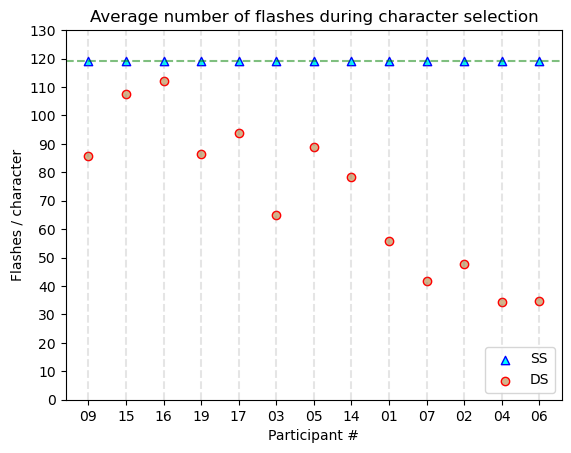

<style scoped>
img[alt~="center"] {
  display: block;
  margin: 0 auto;
}

section {
  font-size: 30px
}
</style>
# **Independent Study Weekly Meeting 10**

#### Improve the results visualization, further investigation, and start on P300 speller with LM

Zion Sheng
Department of ECE
Duke University

---
## Topics

1. Topic 1: Better results visualization
2. Topic 2: Investigation: What happens on Participant #5?
3. Topic 3: Sanity check: experiemnt vs simulation
4. Topic 4: Start on exploring P300 speller with LM

---
## Topic 1: Better results visualization
<style scoped>
img[alt~="center"] {
  display: block;
  margin: 0 auto;
}

section {
  font-size: 30px
}
</style>

We sort the displaying order of these participants by the AUC of their user-specific classifier. The order will be maintained in all the visualizations later.


---
## Topic 1: Better results visualization
<style scoped>
img[alt~="center"] {
  display: block;
  margin: 0 auto;
}

section {
  font-size: 30px
}
</style>

The two graphs both try to illustrate the correlated relationship between the performance of the classifier (AUC) and the character selection accuracy, but the second one is more straigtforward.


 

---
## Topic 1: Better results visualization
<style scoped>
img[alt~="center"] {
  display: block;
  margin: 0 auto;
}

section {
  font-size: 30px
}
</style>

The participants are arranged in the ascending order of their AUCs. Now we can clearly see that the participants need less flashes if their classifier AUC is high.


---
## Topic 1: Better results visualization
<style scoped>
img[alt~="center"] {
  display: block;
  margin: 0 auto;
}

section {
  font-size: 30px
}
</style>

The improvement of visualization also happens on the comparison of accuracies and average stoptimes. The trend here is very obvious.

 

---
## Topic 2: Investigation: What happens on Participant #5?
<style scoped>
img[alt~="center"] {
  display: block;
  margin: 0 auto;
}

section {
  font-size: 25px
}
</style>

```
In test #06, Participant #05 wants to type "DRIVING".
The speller ends up with "DJ6VING".
5 out of 7 selection is correct.
In test #07, Participant #05 wants to type "QUICKLY".
The speller ends up with "YUICJLY".
5 out of 7 selection is correct.
In test #08, Participant #05 wants to type "TOWARDS".
The speller ends up with "TOWARDS".
7 out of 7 selection is correct.
In test #09, Participant #05 wants to type "DAYLIGHT".
The speller ends up with "DQYKIOG\".
3 out of 8 selection is correct.
In test #10, Participant #05 wants to type "5149736".
The speller ends up with "51Ret9,PrdCtrl".
3 out of 7 selection is correct.
```

The overall accuracy of Participant #5 is $64\%$. The first three words are actually very accurate whereas the last two words are far from the expectation given that the participant's classifier has a pretty good performance (AUC = $0.82$). The last two severely drag down the average accuracy. Since the first three are accurate, I tend to believe the lower accuracy in the 4th and 5th word is just caused by randomness.

---
## Topic 3: Sanity check: experiemnt vs simulation
<style scoped>
img[alt~="center"] {
  display: block;
  margin: 0 auto;
}

section {
  font-size: 25px
}
</style>

The data points of (dectectability, accuracy/average-stoptime) from these participants are mostly located at the simulation curve or the nearby area. This implies that the offline/online experiments are conducted correctly.

 

---
## Topic 3: Start on exploring P300 speller with LM
<style scoped>
img[alt~="center"] {
  display: block;
  margin: 0 auto;
}

section {
  font-size: 30px
}
</style>

**Intuition**:
The DS algorithm has the advantage that the initialization procedure for character probabilities provides a mechanism for inclusion of language-based knowledge without affecting the general function of the interface, thus avoiding potential issues associated with increased cognitive load.

**Results**:
The paper utilizes the n-gram model to initialize the probability for the characters. By comparing the experiment results between DS and DSLM, the paper claims that the average participant performance is improved.

- **Bit rate**: 46.12 bits/min ➡️ 54.42 bits/min
- **Accuracy**: 88.89% accuracy ➡️ 90.36% accuracy.


---
## Next step
<style scoped>
img[alt~="center"] {
  display: block;
  margin: 0 auto;
}

section {
  font-size: 30px
}
</style>

**Thread #1**:
✅ sort by the y-axis
✅ update the plot on [pp.6]
✅ plot simulation (stopping-time/accuracy VS detextability index) and see if the actual experiment results (average # of flashes/accuracy) falls on it
✅ investigate participant #5
⏭ try differnt paradigms and mix them (different training/testing pair)

**Thread #2**:
✅ Read the paper "*Utilizing a Language Model to Improve Online Dynamic Data Collection in P300 Spellers*".
⏭ Replicate the result in the paper.