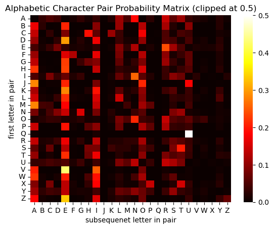
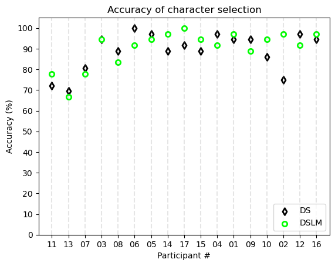
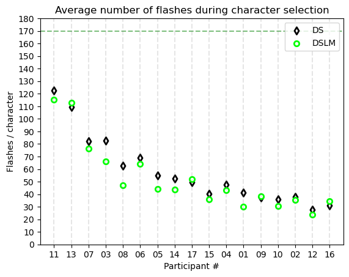
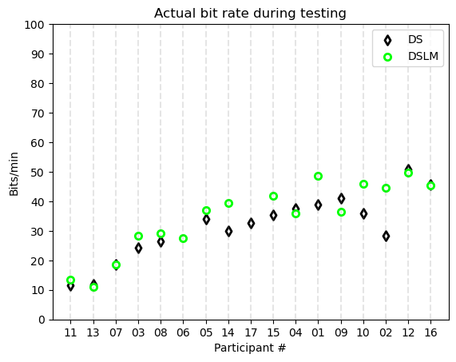
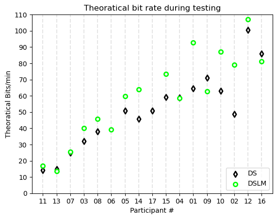

<style scoped>
img[alt~="center"] {
  display: block;
  margin: 0 auto;
}

section {
  font-size: 30px
}
</style>
# **Independent Study Weekly Meeting 11**

#### P300 speller with a simple bi-gram language model

Zion Sheng
Department of ECE
Duke University

---
## Topics

1. Topic 1: Why introduce the bi-gram LM?
2. Topic 2: Integrate bi-gram LM with DS algorithm
3. Topic 3: Results visualization

---
## Topic 1: Why introduce the bi-gram LM?
<style scoped>
img[alt~="center"] {
  display: block;
  margin: 0 auto;
}

section {
  font-size: 25px
}
</style>

### Motivation

The basic observation is that, when we type any English word, the probability distribution of letters is not uniform given the previously typed ones. For example, suppose we already typed `"pr"`, then the next letter is impossible to be `"z"` since there is no English word containing this combination. On the opposite, the probability of letters, such as `"a"` and `"i"`, should be higher.

We can use this info to initialize the probability of each character on the keyboard, in the hope that this can improve the performance. To be more specific, we can integrate a language model such that, each time a participant is going to type a subsequent character $s_t$ after typing $s_{t-1}$, the initial probability of each character $c_i$ is assigned by the conditional prob $P(s_{t} = c_i|s_{t-1})$. We hope that the target character should have a higher initial probability this time so that we can save some time to derive the selection with high confidence.

---
## Topic 1: Why introduce the bi-gram LM?
<style scoped>
img[alt~="center"] {
  display: block;
  margin: 0 auto;
}

section {
  font-size: 25px
}
</style>
Under the Markov assumption, the probability of the next letter only depends on the latest-selected letter $s$. The two-letter pair is called a bi-gram. We have 26 letters on the keyboard, so we have $26 \times 26$ bi-grams. Below is the probability distribution matrix generated using the data from CMU online dictionary ([link](http://www.speech.cs.cmu.edu/cgi-bin/cmudict)):



---
## Topic 2: Integrate bi-gram LM with DS algorithm
<style scoped>
img[alt~="center"] {
  display: block;
  margin: 0 auto;
}

section {
  font-size: 25px
}
</style>

### Workflow

1. Step 1. Use training data to train a SWLDA classifier to classify target/non-target signals (i.e. detect P300 waves).
2. Step 2. During online testing, for each word,  **initialize the probability of each character (say $M$ characters in total) by the following rule**:

   - If (1) it is the first character in the token OR (2) the previous token is non-alphabetic,
then initialize the probabilities by uniform distribution ($\frac{1}{M}$)
   - If the previous token $s_{t-1}$ is alphabetic, then initialize the probability of those alphabetic chars $c_i$ by $P(s_t=c_i|s_{t-1})(1-\sum_{NAC}\frac{1}{M})$, where $NAC$ is the number of non-alphabetic chars. For those non-alphabetic chars, initial prob is still $\frac{1}{M}$.

1. Step 3: randomly flash a column or a row for at most 10 sequences, each of which consists of (9 rows + 8 cols). Update the probs after each flash using the DS algorithm until the prob of one char reaches the threshold OR no more flashes.

---
## Topic 3: Results visualization
<style scoped>
img[alt~="center"] {
  display: block;
  margin: 0 auto;
}

section {
  font-size: 25px
}
</style>

The data we are using is located at:
```
/hpc/group/mainsahlab/BCIData/EDFData/StudyD
```
Quick overview of the experiment:
- Number of participants: 17 (index from `01` to `17`).
- Training/testing: 6 6-char tokens for each participant.
- In testing, we divide into `DS` (w/o the bi-gram LM) and `DSLM` (with the bi-gram LM)
- For each character in a token, max number of flashes: $(8+9)\times 10 = 170$.
- Time duration for a flash = $0.0625$ s; Time interval between flashes = $0.0625$ s.
- Time interval between characters: $3.5$ s.
- Max completeion time for one training/testing session: $36\times 170 \times (0.0625+0.0625) + (36-1)\times 3.5 = 14.8$ min
- Prob threshold for a character on keyboard to be selected as the desired one: $90\%$.

---
## Topic 3: Results visualization
<style scoped>
img[alt~="center"] {
  display: block;
  margin: 0 auto;
}

section {
  font-size: 25px
}
</style>

The participants are arranged in the ascending order of their AUC. Higher AUC leads to a higher accuracy and fewer flashes needed. Also, DSLM outperforms DS on average, with higher accuracy and less time.

 

---
## Topic 3: Results visualization
<style scoped>
img[alt~="center"] {
  display: block;
  margin: 0 auto;
}

section {
  font-size: 25px
}
</style>

Bit rate is how many bits of information a user can correctly type per minute. This combines the measurement of accuracy and time efficiency. Theoratical bit rate minus the time intervals between each character ($=(36-1) \times 3.5 = 122.5$ s) from the total completion time (TCT). Figures below show that DSLM tends to have a higher bit rate for most participants here.

 

---
## Next step
<style scoped>
img[alt~="center"] {
  display: block;
  margin: 0 auto;
}

section {
  font-size: 30px
}
</style>

✅ Read the paper "*Utilizing a Language Model to Improve Online Dynamic Data Collection in P300 Spellers*".
✅ Replicate the result in the paper.
⏭ Read more papers on incorporating NLP techniques to enhance the P300 speller's performance, and try to reproduce the results.

**Note**: the week-12 meeting next week will be **canceled** due to the huge amount of workload, mostly because the final project and presentation of CS590 (theory in ML) are due in that week. I will have more availability after CS 590 is over, but since we will have Thanksgiving in week 13, there will be no online meeting but a **recorded** one. I will send an email to notify this when the time gets closer.

Thanks for your understanding! Stay tuned! 😄
