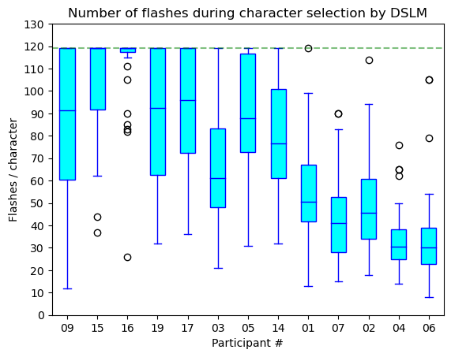

# **Independent Study Weekly Meeting 11**

#### P300 speller with a simple bi-gram language model

Zion Sheng
Department of ECE
Duke University

---
## Topics

1. Topic 1: Why introduce the bi-gram LM?
2. Topic 2: Integrate the bi-gram LM into P300 speller with DS algo
3. Topic 2: Results visualization
4. Topic 3: Performance comparison between DS algorithm with and without the bi-gram LM

---
## Topic 1: Why introduce the bi-gram LM?

### Moivation

The basic observation is that, when we type any English word, the probability distribution of letters is not uniform given the previously typed ones. For example, suppose we already typed `"pr"`, then the next letter is impossible to be `"z"` since there is no English word containing this combination. On the opposite, the probability of letters, such as `"a"` and `"i"`, should be higher.

We can use this info to initialize the probability of each character on the keyboard, in the hope that this can improve the performance. To be more specific, we can integrate a language model such that, each time a participant is going to type a subsequent character $s_t$ after typing $s_{t-1}$, the initial probability of each character $c_i$ is assigned by the conditional prob $P(s_{t} = c_i|s_{t-1})$. We hope that the target character should have a higher initial probability this time so that we can save some time to derive the selection with high confidence.

---
## Topic 1: Why introduce the bi-gram LM?

Under the Markov assumption, the probability of the next letter only depends on the latest letter. The two-letter pair is called a bi-gram. We have 26 letters on the keyboard, so we have $26 \times 26$ bi-grams. We use the data from CMU online dictionary ([link](http://www.speech.cs.cmu.edu/cgi-bin/cmudict)) to generate the probability distrubtion shown as below:

---
## Topic 2: Results visualization

The participants are arranged in the ascending order of their AUCs. Now we can clearly see that the participants need less flashes if their classifier AUC is high.

