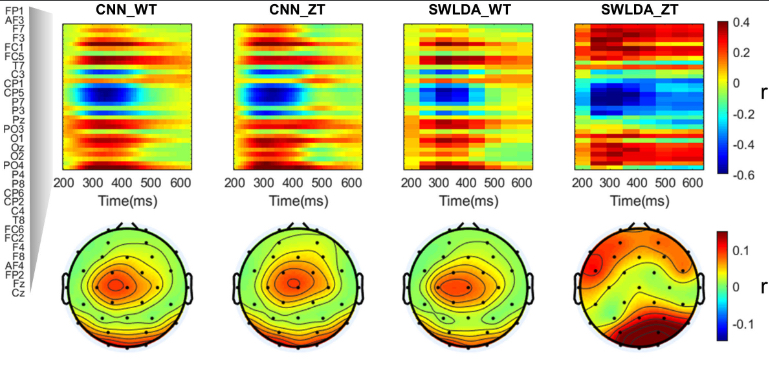
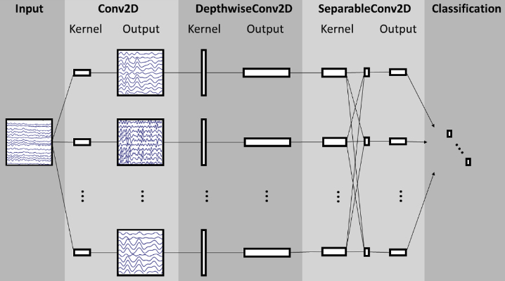
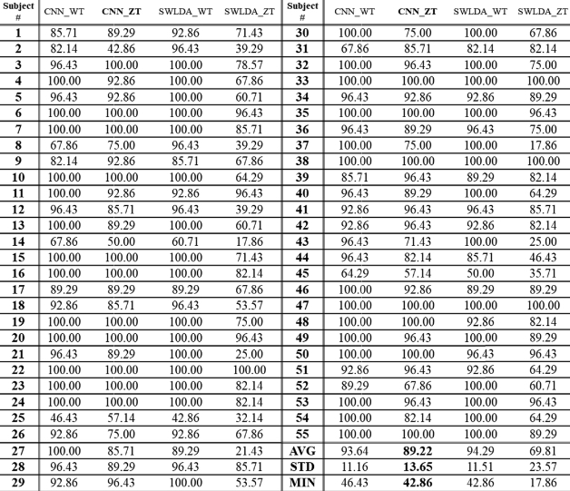

# **Independent Study Weekly Meeting 14**

#### Apply EEGNet to the P300 speller (Part 1)

Zion Sheng
Department of ECE
Duke University

---
## Topics

1. Topic 1: Introduce CNN to the EEG-based BCI
2. Topic 2: What is EEGNet?
3. Topic 3: Thoughts on some other DL methods (LM)

---
## Topic 1: Introduce CNN to the EEG-based BCI

### Motivation:
For the classic P300 speller development workflow, we always start by training a user-specific classifier to differentiate ERP signals and non-ERP signals. This requires users to do some warm-up sessions to train their own classifier before they can actually use it for typing. So the motivation here is: can we bypass this step?

### Some solutions:
- transfer learning (see the review paper by Wan et al., 2021)
- develop a generalized classifier (Lotte et al., 2009; Rivet et al., 2011)
- find a distinctive signal within the trial block (Eldeib et al., 2018)

These methods are useful because the classifier can provide a meaningful output when no previous subject-specific data is present. However, these classifiers still perform at relatively **low levels in the beginning** before they adapt to the new subject.

---
## Topic 1: Introduce CNN to the EEG-based BCI

### The potential power of CNN:
The most prominent example of DL in the BCI field is the application of convolutional neural networks (CNNs), which was originally intended for computer vision tasks like images, but also for audio signals.

Images and audio signals often have a **hierarchical structure**, where local features are important for the current one, and remote features less so. When EEG data is seen as a 2D-array, with the number of time steps as the width ($T$), and the number of electrodes as the height ($C$), EEG data has similar characteristics to an image or audio signal.

Data of nearby timestamps is important for the current datapoint, as well as data from the other channels at the same timestamp.

___
## Topic 1: Introduce CNN to the EEG-based BCI

### The potential power of CNN:

The following image illustrates the locality of the temporal and spatial pattern. The correlation map in the first row picture the Pearson correlation coefficient between a certain electrode and the final output at certain timestamp. The topological graph in the second row shows the mean of these eletrodes across the surface.

---
## Topic 2: What is EEGNet?

### Some details:

Regarding CNNs for EEG data, there are two important operations:
- A **spatial convolution** is applied over all channels, for each timestamp, and thus summarizes information over all channels. The convolutions can be applied multiple times with different kernel values, creating different types of summaries of the original data (i.e., multiple feature maps).
-  A **temporal convolution** has a kernel size of $1 \times T$, where the sliding window will go over each channel with a certain timeframe, and therefore summarizes the EEG data over the timeframe for each channel.
-  The **separable convolution** is basically pointwise convolution, a type of convolution that uses a 1x1 kernel: a kernel that iterates through every single point.

---
## Topic 2: What is EEGNet?

### Visualization of EEGNet:

---
## Result comparison

---

## Next step

⏭ Read the paper "*Language Model-Guided Classifier Adaptation for Brain-Computer Interfaces for Communication*".
⏭ Replicate the result in the EEGNet paper.

