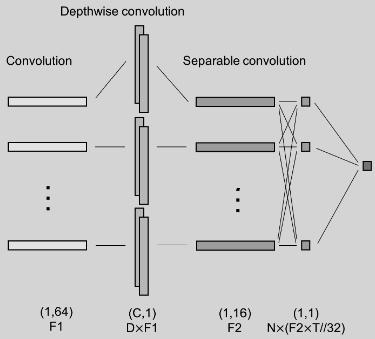
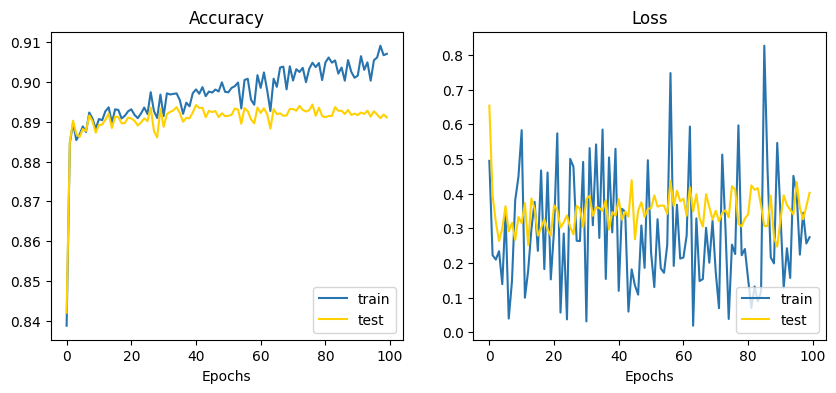

# **Independent Study Weekly Meeting 14**

#### Apply EEGNet to the P300 speller based on Lee et al's work (2020)

Zion Sheng
Department of ECE
Duke University

---
## Topics

1. Topic 1: Introduce CNN to the EEG-based BCI
2. Topic 2: What is EEGNet?
3. Topic 3: My implementation and questions
4. Topic 4: Thoughts on other DL methods (with LM focus)

---
## Topic 1: Introduce CNN to the EEG-based BCI

### Motivation:
For the classic P300 speller development workflow, we always start by training a user-specific classifier to differentiate ERP signals and non-ERP signals. This requires users to do some warm-up sessions to train their own classifier before they can actually use it for typing. So the motivation here is: can we bypass this step?

### Some solutions:
- transfer learning (see the review paper by Wan et al., 2021)
- develop a generalized classifier (Lotte et al., 2009; Rivet et al., 2011)
- find a distinctive signal within the trial block (Eldeib et al., 2018)

These methods are useful because the classifier can provide a meaningful output when no previous subject-specific data is present. However, these classifiers still perform at relatively **low levels in the beginning** before they adapt to the new subject.

---
## Topic 1: Introduce CNN to the EEG-based BCI

### The potential power of CNN:
The most prominent example of DL in the BCI field is the application of convolutional neural networks (CNNs), which was originally intended for computer vision tasks like images, but also for audio signals.

Images and audio signals often have a **hierarchical structure**, where local features are important for the current one, and remote features less so. When EEG data is seen as a 2D-array, with the number of time steps as the width ($T$), and the number of electrodes as the height ($C$), EEG data has similar characteristics to an image or audio signal.

Data of nearby timestamps is important for the current datapoint, as well as data from the other channels at the same timestamp.

___
## Topic 1: Introduce CNN to the EEG-based BCI

### The potential power of CNN:

The following image [1] illustrates the locality of the temporal and spatial pattern. The correlation map in the first row picture the Pearson correlation coefficient between a certain electrode and the final output at certain timestamp. The topological graph in the second row shows the mean of these eletrodes across the surface.

---
## Topic 2: What is EEGNet?

### Some details:

Regarding CNNs for EEG data, there are two important operations:
- A **spatial convolution** is applied over all channels, for each timestamp, and thus summarizes information over all channels. The convolutions can be applied multiple times with different kernel values, creating different types of summaries of the original data (i.e., multiple feature maps).
-  A **temporal convolution** has a kernel size of $1 \times T$, where the sliding window will go over each channel with a certain timeframe, and therefore summarizes the EEG data over the timeframe for each channel.
-  The **separable convolution** is basically pointwise convolution, a type of convolution that uses a 1x1 kernel: a kernel that iterates through every single point.

---
## Topic 2: What is EEGNet?

### Visualization of EEGNet (from [2]):

---
## Result comparison (from [1])

---
## Topic 3: My implementation and questions

There are several open-sourced implementations of EEGNet. I chose this [one](https://www.kaggle.com/code/xevhemary/eeg-pytorch/notebook#HyperParameter) as the reference and implement my EEGNet for the P300 speller I am working on ($8 \times 9$, RC paradigm). But soon I realized there is one important thing not clearly specified in the paper - **what this EEGNet classifier actually classifies**. At first, I took for granted that it replaced the SWLDA classifier in the EEG signal classification section, ie. classifying if the signal contains ERP or not. However, the problem is how can the output of the EEGNet classifier be integrated with the main BCI where we decide the targeted rows and columns. As far as I know, this is not clearly demonstrated in the paper. The classifier generates some "output scores", but no more details are provided on how to derive the scores and they decide the BCI's output.

However, I still implement an EEGNet model for the EEG signal classification task (`1`: with the appearance of event-related potential; `0`: w/o ERP).

---
## Topic 3: My implementation and questions

The architecture of my EEGNet looks like this ((from [1])):

F1 = number of temporal filters = 64, D = depth multiplier (number of spatial filters) = 4, F2 = number of pointwise filters = 256, and N = number of classes = 2, T = 195.

---
## Topic 3: My implementation and questions

We use SGD to train this network with `BATCH_SIZE = 32`. We use Adam as the optimization algorithm to update the weights with a fixed learning rate `LR = 0.001`. The number of epochs is 100. The training and testing data set are the same as we used before, which is stored in `EDFData-StudyA`. The accuracy and loss during the training process are shown in the two graphs below. The best test accuracy is $89.3\%$.

---
## Topic 3: My implementation and questions

We also compute the average test accuracy using the SWLDA classifier, which is $88.5\%$. So the EEGNet classifier ($89.3\%$) can perform slightly better than the SWLDA classifier. However, we need to notice that we avoid the repeated training process on each participant for the EEGNet classifier. The generalizability of EEGNet is verified by our result.

**Further work**:
- Try to get more result visualization, such as each participant's performance.
- Tweak the training configuration to see if we can achieve higher accuracy.
- Try to interpret what is learned by our EEGNet.
- Figure out how to integrate this EEGNet classifier with the rest of the P300 speller.

---

## Next step

As I planned before, I am interested in exploring the possibility of applying some DL-based language models on the P300 speller we are developing. It turns out that EEGNet is not the one I am looking for. So far, I know the latest paper published by Professors and Janet (2022) is LM-related, so the last mission for this semester is to read this paper and reproduce some results. Hopefully, I can learn something from it, and explore more DL-based methods.

✅ Replicate part of results in the EEGNet paper.
⏭ Read the paper *Language Model-Guided Classifier Adaptation for Brain-Computer Interfaces for Communication*.

---

## Reference

[1] Lee, Jongmin, et al. "CNN with large data achieves true zero-training in online P300 brain-computer interface." *IEEE Access* 8 (2020): 74385-74400.

[2] Lawhern, Vernon J., et al. "EEGNet: a compact convolutional neural network for EEG-based brain–computer interfaces." *Journal of neural engineering* 15.5 (2018): 056013.

