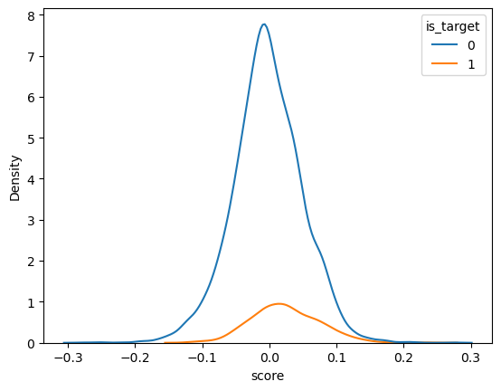
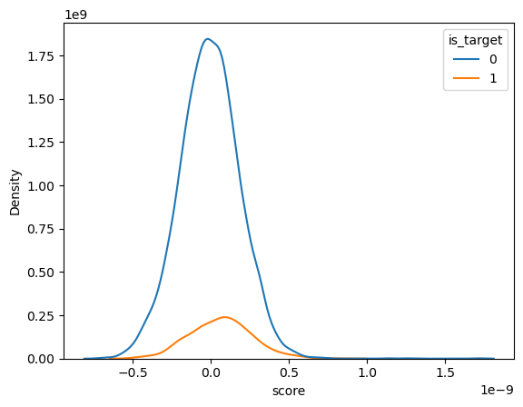
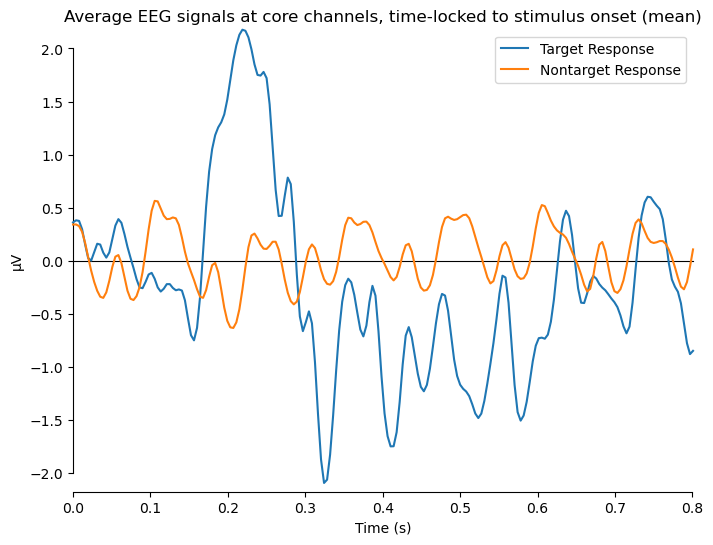

# **Independent Study Weekly Meeting 7**

#### Experiment with some Classifers for Target and Non-target Responses classification

Zion Sheng
Department of ECE
Duke University

---
## Table of Content

1. Part 1: Progress Made This Week
2. Part 2: EEG Data Preprocess Before Training
3. Part 3: Stepwise LDA (SWLDA) algorithms
4. Part 4: Results
5. Part 5: Deeper Thoughts

---
## Part 1: Progess Made This Week

- Read the paper *Increasing BCI communication rates with dynamic stopping towards more practical use: an ALS study*.
- Implement SWLDA algorithm in Python (with the help from Janet).
- Train some classifiers for responses classification.

---
## Part 2: EEG Data Preprocess Before Training
### The data I am using

The data is downloaded from `/BCIData/EDFData/StudyA/A01/SE001/`.
For simplicity, I only use **one** experiment object, whereas the original paper uses data from 10 ALS patients. I also use the **RC** paradigm data with a $9 \times 8$ grid. In each independent training/testing dataset, the experiment object is asked to spell a short word. For example, in `A01_SE001RC_Train01.edf`, the desired word is "DRIVING".

For further simplicity, I only use one training dataset and one testing dataset.
training set = `A01_SE001RC_Train01.edf`,
testing set  = `A01_SE001RC_Test06.edf`

---
## Part 2: EEG Data Preprocess Before Training
### Proprocessing

- Create epochs with 833 samples and 256 HZ sampling Hz. The time span of each epoch starts at 0 ms and ends at 800 ms. Among the 833 samples, 98 of them are target repsonses and the remaining 735 are non-targets. For each sample, we have 206 timestamps.

- Select the 8 core channels: Fz, Cz, P3, Pz, P4, PO7, PO8, and Oz.

- Maintain the first 195 timestamps and take the averge for every 13 timestamps to downsample the original samples. Now, each sample only has 15 samples.

Now, we have 833 samples. Each one is generated after a flash. We have 8 channels, and each channel contains obseravtions from 15 timestamps.

---
## Part 3: Stepwise LDA (SWLDA) algorithms

What is the difference between SWLDA and LDA?

Some of my thoughts:
- Update model weights in each step (what is the "step" here)?
- When doing Offline learning, is it the same as normal LDA?

---
### Part 4: Results :(
The left is from SWLDA, and the right is from logistic regression.
| | |
|-|-|

---
### Part 5: Deep Thoughts

Why the classifier doesn't work?
- Data? I tried different training/testing data. Still the same.

- Downsampling step? take a look at this:

- Maybe my VScode???
