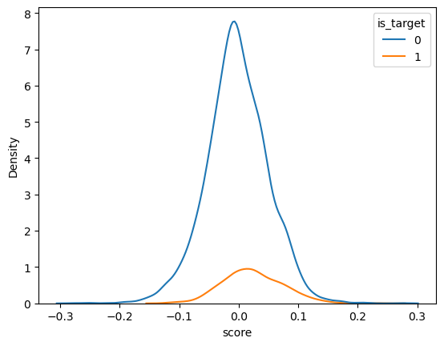
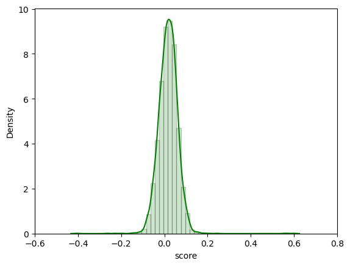
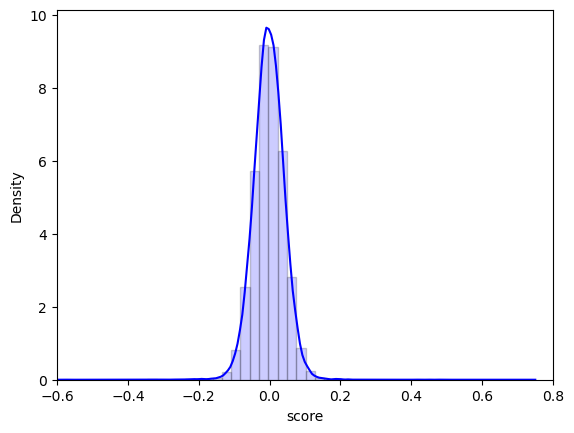
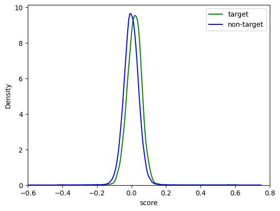
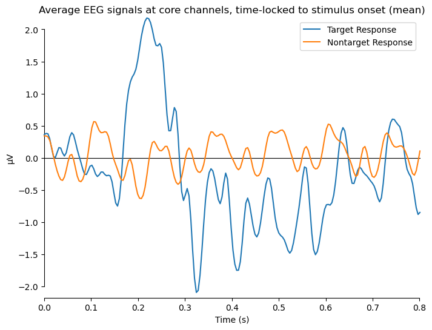
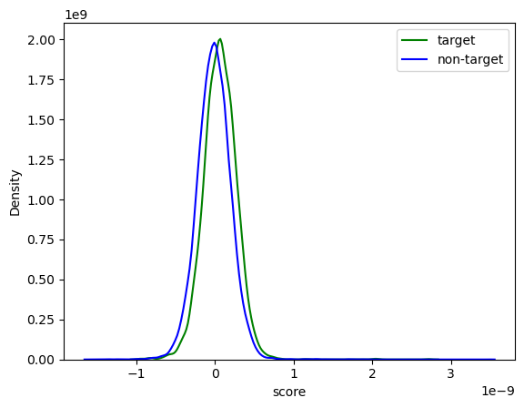
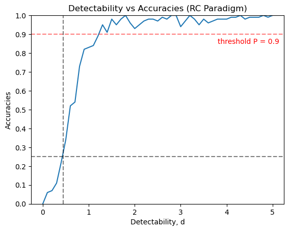

# **Independent Study Weekly Meeting 8**

#### Built the Target/Non-target Response classifer

Zion Sheng
Department of ECE
Duke University

---
## Topics

1. Topic 1: Fixing the Code and More Visualization Results
2. Topic 2: For the Next - Apply the classifier
3. Topic 3: Project Ideas

---
## Topic 1: Fixing the Code and More Visualization

Last time, we plot the KDE plots for target and non-target class using `seaborn`. The result is not right since the KDE plot for the non-target class is much higher than the target.

This time we didn't enter the whole `pd.Dataframe` which contains the targets and non-targets together. Rather, we separate them and plot them individually. **The problem is solved!**

---
## Topic 1: Fixing the Code and More Visualization

Now the height of the peaks are almost the same. Both are pretty standard bell-shape. The only difference is that the location of the peak is slightly different. This implies this two KDE plots only differs at the mean. The AUC for this classifier is $0.63$, which is far from ideal.

| | ||
|-|-|-|

**Question**: Is it guaranteed to get the bell-shape?

---
## Topic 1: Fixing the Code and More Visualization

Even just eyeballing at the average EEG waves of the two classes (shown above), we can see an obvious difference. Why doesn't the SWLDA classifier capture this pattern?

Maybe use other classifier can fix it?

---
## Topic 1: Fixing the Code and More Visualization

Let's try logistic classifier. Turns out they are still so close!

**Question**: I guess the average EEG signals doesn't reflect the actual distribution of these two types of responses. But I am still very confused.

---
## Topic 1: Fixing the Code and More Visualization

What is the expected accuracy level of this "weak" classifier?

If we run the simulation of the DS algorithm, the expected accuracy of this classifier is only around $25\%$, which we can forsee how untrue the predicted text it can give.

---
## Topic 2: For the Next - Apply the classifier

We only have one step ahead to apply this classifier and see how it actually performs. But I am still very concerned about its performance, given the low expected accuracy from the simulation.

I'm sure that it's not the fault of the classifier algorithms. Maybe I can choose some other participants (data)?

---
## Topic 3: Project Ideas

The project for this class is completely open ended. You are encouraged to pick any topic you wish as long as there is a direct connection to the theory of machine learning algorithms, models, or applications. For example, you can study the theory behind the methods we study in class, or **you can apply a theoretically guaranteed method to study an interesting problem in your own field of interest**.

Study an application of your own interest, like computer vision, sociology, psychology and biology. If you choose to do an application, I expect you to do some experiments on real datasets and get some interesting conclusions. It is also important that you **run a method with theoretical guarantees**, and **discuss whether the assumptions are satisfied on the datasets.**