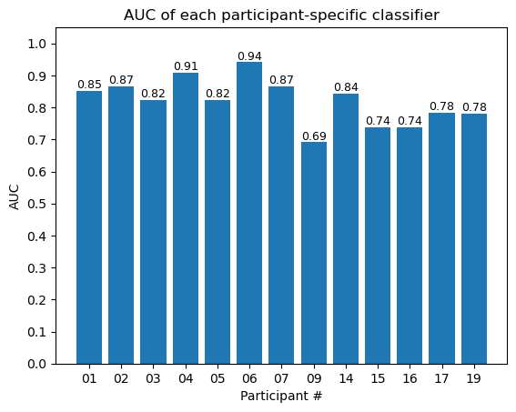
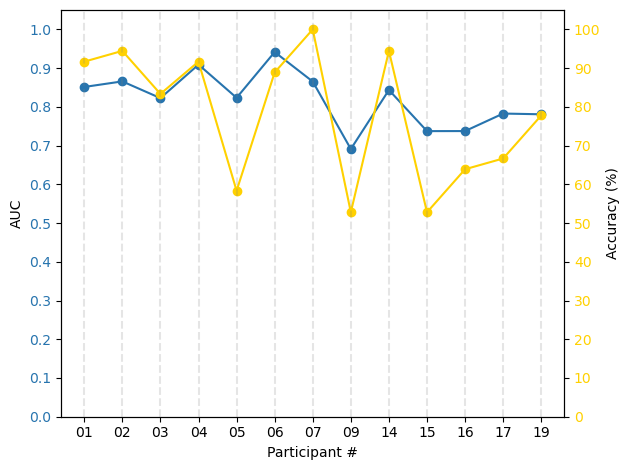
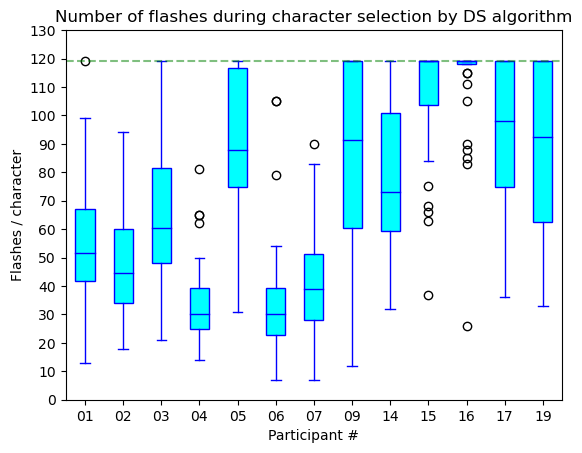
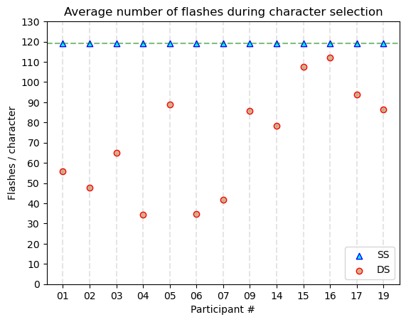
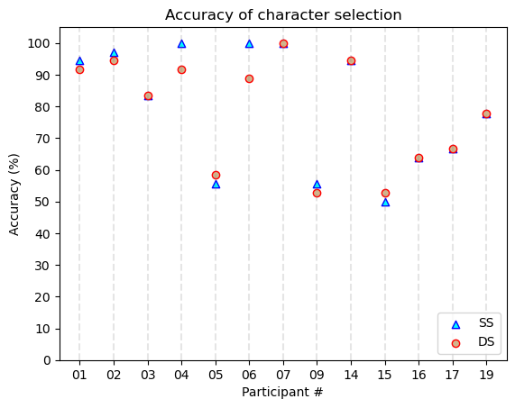

# **Independent Study Weekly Meeting 9**

#### Develop the Complete Pipeline of P300 Speller

Zion Sheng
Department of ECE
Duke University

---
## Topics

1. Topic 1: Overview of the pipeline
2. Topic 2: Fix the previous bugs
3. Topic 3: Results visualization

---
## Topic 1: Overview of the pipeline

**Offline (Training)**: Train the classifier by stepwise linear discriminant analysis algorithm (SWLDA).

**Online (Testing)**: Apply the classifer to process the real-time EEG signals from the participant and generate the classifier score. Use SS or DS algorithms to update the probability of every characters on the screen with the classifier score, and finally choose the character with the highest probability.

---
## Topic 2: Fix the previous bugs

- **Bug #1**: Incorrectly construct the training features. After downsampling, we have 15 observations (EEG signal values) for every `Epoch`. The features are the concatenation of these 15 observations across the 8 core channels, so that we will end up with 120 features from each `Epoch`. Previously, I took these channels separately, so I only had 15 features. After fixing this, AUC of most classifiers are close to $1$ now.

- **Bug #2**: I accidenttally set "RD" (random paradigm) data as the train set and "RC" (row-column) data as the test set. I didn't find this bug until I restructured my code. This bug didn't elicit any error message from Python, and the result seemed to be reasonable.

---
## Topic 3: Results visualization

Most classifiers are pretty well.

---
## Topic 3: Results visualization

Classifiers with higher AUC leads to a higher spelling accuracy. **TODO**: change this plot to a accuracy VS AUC scatter plot.

---
## Topic 3: Results visualization

Number of flashes also varies across differnt participants. I believe it also related with the classifier's performance. Might also draw a number of flashes VS AUC scatter plot.

---
## Topic 3: Results visualization

Dynamic stopping saves a lot of time.

---
## Topic 3: Results visualization

Choosing SS or DS doesn't affect the spelling accuracy too much for most participants. But for #04 and #6...

---
## Topic 3: Results visualization

| | |
|-|-|